# ⚡ DocuPulse AI — Hybrid RAG & Multimodal Intelligence Engine

<div align="center">


<p align="center">
  <strong>Plataforma corporativa de ingestão de documentos não estruturados, OCR multimodal e RAG Híbrido com algoritmo Reciprocal Rank Fusion (RRF).</strong>
</p>

</div>

---

## 📖 Visão Geral

O **DocuPulse AI** é uma solução de inteligência artificial de ponta a ponta projetada para extrair, indexar e consultar informações críticas em documentos corporativos complexos (demonstrativos contábeis, notas fiscais, contratos, relatórios financeiros em PDF e imagens).

A plataforma utiliza **Busca Híbrida (Hybrid Search)** combinando indexação vetorial semântica de alta dimensionalidade (`pgvector` com índice HNSW) e busca textual por palavras-chave (`Full-Text Search` em português), fundidas pelo algoritmo **Reciprocal Rank Fusion (RRF)** para eliminar alucinações e garantir rastreabilidade factual através de citações diretas das fontes indexadas.

---

## 🏛️ Arquitetura do Sistema

```mermaid
flowchart TD
    subgraph Ingestao["📥 Pipeline de Ingestão Multimodal"]
        A[Upload: PDF, Imagem, CSV, TXT] --> B{Tipo de Arquivo?}
        B -->|PDF| C[PyMuPDF: Extração Digital]
        B -->|Imagem/Escaneado| D[Gemini Vision OCR: Estruturação de Tabelas]
        B -->|CSV/Tabular| E[Polars: Análise Estatística]
        C --> F[Recursive Character Chunker]
        D --> F
        E --> F
        F --> G[Gemini Embedding 768d]
        G --> H[(PostgreSQL + pgvector)]
    end

    subgraph Consulta["🔍 Pipeline de Consulta RAG Híbrido"]
        U[Pergunta do Usuário] --> V[Vetorização da Query 768d]
        V --> W[Busca Semântica: pgvector HNSW]
        U --> X[Busca Textual: tsvector Full-Text]
        W --> Y[Fusão de Ranks: Algoritmo RRF]
        X --> Y
        Y --> Z[Montagem de Prompt Aumentado com Fontes]
        Z --> S[Gemini 3.5 Flash-Lite: Streaming SSE]
        S --> UI[Nuxt 3 Frontend: Renderização de Markdown & Fontes Clicáveis]
    end
```



---

## 🚀 Principais Diferenciais Técnicos

### 1. ⚡ RAG Híbrido com Fusão Recíproca de Ranks (RRF)
* Não depende apenas de vetores: combina similaridade por distância de cosseno (`vector_cosine_ops`) e relevância léxica (`ts_rank_cd`).
* O algoritmo RRF balanceia os pesos dinamicamente com base na configuração do usuário (ex: 60% semântica / 40% palavras-chave).

### 2. 👁️ Extração Visual & OCR de Tabelas com Gemini Multimodal
* Converte automaticamente demonstrativos contábeis, notas fiscais e relatórios escaneados em **tabelas estruturadas Markdown** com valores e códigos preservados.
* Tratamento híbrido de PDFs com PyMuPDF: páginas com texto digital são lidas instantaneamente; páginas escaneadas passam por OCR multimodal.

### 3. 🌊 Streaming Assíncrono com SSE (Server-Sent Events)
* Implementação 100% assíncrona com `client.aio` do SDK moderno `google-genai`.
* Transmissão token a token em tempo real com **latência inferior a 1 segundo** e emissão prévia de metadados das fontes consultadas.

### 4. 🛡️ Engenharia de Software e Tipagem Estrita
* **Backend:** FastAPI modularizado por domínio, validação com **Pydantic v2**, injeção de dependências (`Depends`) e pool assíncrono singleton com `psycopg-pool`.
* **Frontend:** Nuxt 3 / Vue 3 Composition API com **TypeScript Strict**, sem uso de `any`, delegação de eventos para renderização de tabelas e fontes clicáveis.

---

## 🛠️ Stack Tecnológica

| Camada | Tecnologias |
| :--- | :--- |
| **Frontend** | Nuxt 3, Vue 3, TypeScript, Tailwind CSS, Marked |
| **Backend** | Python 3.11+, FastAPI, Uvicorn, Pydantic v2, Pydantic Settings |
| **Inteligência Artificial** | Google GenAI SDK (`gemini-3.5-flash-lite`, `gemini-embedding-001`) |
| **Banco de Dados & Vetores** | PostgreSQL 16+, pgvector (HNSW Indexing), Full-Text Search (GIN) |
| **Processamento de Dados** | PyMuPDF (fitz), Polars, psycopg 3 (async) |

---

## ⚙️ Como Executar o Projeto

### 🐳 Opção Recomendada: Docker Compose (1 Comando)

Com o Docker instalado, você sobe o banco de dados PostgreSQL com `pgvector` pré-configurado, o backend FastAPI e o frontend Nuxt de forma integrada:

```bash
# 1. Clone o repositório
git clone https://github.com/DanRod01/docupulse-ai.git
cd docupulse-ai

# 2. Configure a sua chave do Gemini
export GEMINI_API_KEY="sua_chave_aqui"  # Linux/macOS
$env:GEMINI_API_KEY="sua_chave_aqui"    # Windows PowerShell

# 3. Inicie todos os serviços com orquestração automática
docker compose up -d --build
```
> * Frontend: `http://localhost:3000`  
> * Swagger UI: `http://localhost:8000/docs`  
> * PostgreSQL + pgvector: `localhost:5432` (migrações SQL e funções RRF aplicadas automaticamente na inicialização)

---

### 💻 Opção 2: Execução Manual Local

#### Pré-requisitos
* Python 3.11 ou superior
* Node.js 18+ e npm
* Instância do PostgreSQL com extensão `pgvector` ativa (ex: Supabase ou PostgreSQL local)
* Chave de API do [Google AI Studio](https://aistudio.google.com) (gratuita)

---

#### 1. Configurar o Banco de Dados
Execute o script de migração SQL no seu banco PostgreSQL:
* Arquivo: `backend/app/db/migrations/001_initial_schema.sql`

---

### 2. Configurar e Rodar o Backend

```bash
# 1. Acesse o diretório do backend
cd backend

# 2. Crie e ative o ambiente virtual
python -m venv .venv

# Windows (PowerShell):
.\.venv\Scripts\Activate.ps1
# Linux/macOS:
source .venv/bin/activate

# 3. Instale as dependências
pip install -r requirements.txt

# 4. Configure o arquivo de variáveis de ambiente
cp .env.example .env
# Edite o .env e preencha GEMINI_API_KEY e DATABASE_URL

# 5. Inicie o servidor FastAPI
uvicorn app.main:app --reload --port 8000
```

> **Swagger UI:** A documentação interativa da API estará acessível em: `http://localhost:8000/docs`

---

### 3. Configurar e Rodar o Frontend

```bash
# 1. Em outro terminal, acesse o diretório do frontend
cd frontend

# 2. Instale as dependências
npm install

# 3. Configure as variáveis de ambiente (opcional, padrão: localhost:8000)
cp .env.example .env

# 4. Inicie o servidor de desenvolvimento Nuxt 3
npm run dev
```

> **Aplicação Web:** Acesse em seu navegador: `http://localhost:3000`

---

## 📡 Principais Endpoints da API

| Método | Endpoint | Descrição |
| :---: | :--- | :--- |
| `POST` | `/api/v1/documents/upload` | Ingestão, OCR, chunking e indexação vetorial de arquivos |
| `GET` | `/api/v1/documents` | Listagem de documentos e total de chunks indexados |
| `DELETE`| `/api/v1/documents/{id}` | Remoção de documento e chunks em cascata |
| `POST` | `/api/v1/rag/stream` | Chat RAG com streaming SSE em tempo real |
| `POST` | `/api/v1/search/hybrid` | Busca híbrida direta com ranking RRF |
| `GET` | `/api/v1/health` | Diagnóstico de integridade do banco e chaves de IA |

---

## 🧪 Testes Automatizados

O backend conta com uma suíte de testes unitários automatizados com `pytest`:

```bash
cd backend
python -m pytest -v
```

---

## 📄 Licença

Este projeto está licenciado sob a Licença MIT — consulte o arquivo [LICENSE](LICENSE) para detalhes.
